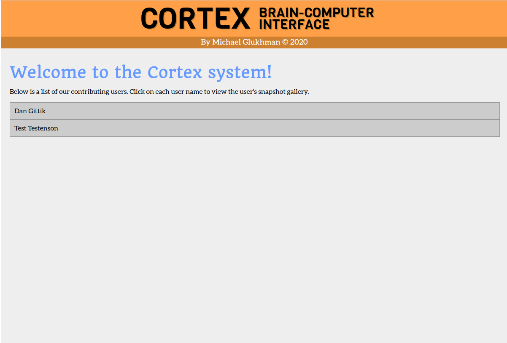

# Cortex
Cortex is a client-server system which receives special <i>snapshots</i> files from the user, that include
photos the user has taken, as well as various metadata such as a depth map of the taken image, the position
and rotation of the camera and the feelings the user had while taking the image. It then parses the snapshots,
saves the results to a database and presents the parsed snapshots as a gallery in a website it renders.

The workflow of the Cortex system is presented in the following flow chart:


This project was done by Michael Glukhman for the Advanced System Design course in Tel Aviv University. &copy; 2020

## Table of Contents
* [The system's components](#system_components)
    - [The client and the snapshots file](#client)
    - [The server](#server)
    - [The parsers](#parsers)
    - [The saver](#saver)
    - [The API server](#api)
    - [The CLI client](#cli)
    - [The GUI](#gui)
* [Installation and deployment](#installation)

# The system's components <a name="system_components"></a>
As shown in the above flow chart, the Cortex system consists of several components, some of them operate on the client side and some on the server side. Each component is written to operate independently, so that it can easily be replaced
by a different component which fits the same role (exposes and uses the same API's), so that the other components of the
system can treat it as a "black box".
This modularity also allows the wrapping of each server-side component inside a docker container, running as a micro-service.

## The client and the snapshots file <a name="client"></a>
At the client side, the user uploads to Cortex, using the **upload-sample** command, a special snapshots file, which contains all the data to be parsed by the system.
The currently supported file format is a g-zipped Google's <a href="https://developers.google.com/protocol-buffers/docs/proto3">Protobuf 3</a>, which has the following structure:
* A <b>user data</b> message, preceded by a 4-byte unsigned integer representing the size of the data in bytes, and containing the following fields:
    * _user_id_: an 8-byte unsigned integer;
    * _username_: a string;
    * _birthday_: a 4-byte unsigned integer representing the user's birth date in UNIX time;
    * _gender_: an Enumerator with 3 options: 0 = MALE, 1 = FEMALE, 2 = OTHER.
* Multiple **snapshot** messages, each preceded by a 4-byte unsigned integer representing the size of the data in bytes, and containing the following fields:
    * _datetime_: an 8-byte unsigned integer representing the time in microseconds (in UNIX time) at which the snapshot_ was taken
    * _pose_: representation of the user's pose while taking the snapshot, having the following fields:
        1. _translation_: three double-precision floats, representing camera position on axes X, Y and Z;
        2. _rotation_: four double-precision floats, representing the  camera rotation quaternion;
        3. _color_image_: two 4-byte unsigned integers representing width and height, following by pixel data of the photographed image, with 3 bytes per pixel;
        4. _depth_image_: two 4-byte unsigned integers representing width and height, following by a pixel data of a heat map of image depth, with a 4-byte float per pixel;
        5. _feelings_: four single-precision floats, representing the user's feelings of hunger, thirst, exhaustion and happiness while taking the snapshot, in a scale of -1 to 1 each.

The client reads the file using the default reader protocol (currently _Protobuf 3_): first the user data and then one snapshot at a time, re-packs each message using a Protobuf 3 protocol (same as the default reader but not coupled with it in the code) and sends the messages to the server over a socket connection.

The client exposes the following Python API:
```python
from bci.client import upload_sample
upload_sample(host='127.0.0.1', port=5000, path='sample.mind.gz')
```
where `host` is the IP address or hostname of the server, `port` is the port on which the server communicates
and `path` is the relative or absolute path to a snapshots file;

And the following command line interface:
```bash
python -m bci.client upload-sample -h/--host '127.0.0.1' -p/--port 5000 'snapshot.mind.gz'
```
with the same arguments.<br>
The default arguments for both API's are: host = **'127.0.0.1'**, port = **5000**.

An additional `format` argument, available in both the python API and the CLI (as -f/--format <format>), allows the user to specify the reader module with which the uploaded snapshots file should be read. Currently, only `'protobuf'` is available and is set as the default.

#### Adding a reader module for snapshots
In order to add to the client a different reader module, so snapshots files in formats other than Protobuf 3 can be read, one needs to do the following:
1. write a new reader class and put it in a file `bci/readers/<format_name>.py` in the project.
2. at the bottom of the file, add the following: `reader_cls = <format_name>`
3. from now on, the new format becomes available in the CLI with `bci.client upload-sample ... -f/--format <format_name>`and in the python API with `bci.client.upload_sample(..., format=<format_name>)`
4. to set the new format as default, in `bci/utils/constants.py` specify `DEFAULT_FORMAT=<format_name>`

## The server <a name="server"></a>
The server, via the <b>run-server</b> command receives messages from clients over a socket connection. For each message it unpacks it using the same _Protobuf 3_ protocol as the client, and publishes it to the message queue given in the `message-queue-url` argument (see busage below), using the protocol given in that URL's scheme (currently supporting only _rabbitmq_).
The current rabbitmq publisher does the following:
	  - For user data messages it simply repacks the message with the same Protobuf 3 protocol as the server and publishes it to the massage queue under users topic;
	  - For snapshot messages it repacks the message with the same Protobuf 3 protocol as the server, saves it as a snapshot.raw file in the `data/<user_id>/<timestamp>` path, and publishes to the massage queue:
        1. the address of the raw snapshot to a **raw_snapshot** fanout exchange; and
        2. the metadata (id, user id, time stamp) of the snapshot under snapshots topic, in JSON format.
    After a successful publishing, or a failure, the server sends an acknowledgement (ACK) message back to the client, which can then proceed to sent the next messages.

The server exposes the following Python API:
```python
from bci.server import run_server
run_server(host='127.0.0.1', port=5000, publish=publisher_function})
```
where `host` is the IP address or hostname of the server, `port` is the port on which the server communicates
and `publish` is publishing function which has one argument and `**kwargs` defined, e.g.:
```python
def log_message(message, **kwargs):
      print(message, file=open('/tmp/test.log', 'a'))
```

And the following command line interface:
```bash
python -m bci.server run-server -h/--host '127.0.0.1' -p/--port 5000 'rabbitmq://127.0.0.1:5672/'
```
where `host` and `port` are the same as above, while the last argument is the address (IP:port) of
the message queue, preceded by the protocol used (currently, only _rabbitmq_ is supported).<br>
The default arguments for both API's are: host = **'127.0.0.1'**, port = **5000**.

#### Adding a publisher module
In order to add custom publisher module, write a new publisher function with the signature `publish(message, **kwargs)` and put it in a file `bci/publishers/<publisher_name>.py` in the project.
A module named _<publisher_name>_ will become available for use as a _scheme_ in the publisher URL in the CLI above.
The following key-word arguments (kwargs) are available for publisher functions:
- provided by the Python API `run_server`:    msg_type, user_id
- provided by the CLI function:    publisher_host, publisher_port

## The parsers <a name="parsers"></a>
Parsers are micro-services which receive raw snapshot data (a file path is consumed from the message queue through the **raw_snapshot** fanout exchange, and the data itself from the file system, see the [server](#server) above), parse it in some way and publish the results to the message queue on a dedicated topic (in JSON format), to be later saved to the database by the [saver](#saver) component.
For color and depth images, only metadata is published (image id, height, width, image url) while the parsed image itself is saved as a file in the file system, in `data/{color,depth}_images/<id>`.

The parser module has a **parse** function, which actually calls the requested parsing engine, and parses data from a file in a given _raw_datapath_, and a **run-parser** function, which runs continuously as a service, consuming messages from the message queue, and calls _parse_ as part on its action.

Each parser exposes the following Python API:
```python
from bci.parsers import run_parser
result = run_parser('<parser_name>', '<raw_data_path>')
```
which accepts a parser name and the path to a raw data file (as consumed from the message queue), and returns the result (as published to the message queue);

And the following command line interface:
```bash
python -m bci.parsers parse '<parser_name>' '<raw_data_path>' > '<parsed_data_path>'
```
which accepts a parser name and the path to a raw data file (as consumed from the message queue), and prints the result (as published to the message queue) or redirects it to a result file as in the example above.

A parsing service continuously consuming from the message queue is available by:
```bash
python -m bci.parsers run-parser '<parser_name>' 'rabbitmq://127.0.0.1:5672/'
```
where the last argument is the address (IP:port) of the message queue,
preceded by the protocol used (currently, only _rabbitmq_ is supported).

Parsers currently available are:
- **feelings**: parses and publishes a JSON of the user's feelings while taking the snapshot;
- **pose**: parses and publishes a JSON of the camera position and rotation while taking the snapshot;
- **color_image**: renders the actual image taken by the user, in JPEG format, and publishes the image metadata;
- **depth_image**: renders a heat-map representing the depth dimension of the image taken by the user, in PNG format (using the _pyplot_ library), and publishes the resulting image metadata.

#### Adding a parser module
In order to add custom parser modules, one has to create a file named `<parser_name>.py` in the
`bci/parsing` directory, containing the following:
```python
from ..parsers import BasicParser

class MyParser(BasicParser):
    def parse(self, raw_snapshot_path):
        # your parsing code here, generating some savable result
        return result

parser_cls = MyParser
```
A parser named _<parser_name>_ will become available for use in the Python API and CLI above.

## The saver <a name="saver"></a>
The saver consumes messages from the message queue through the various topic exchanges, and saves the message data to a database in the given URL, using the database service provided in the **run-saver** function's URL scheme (currently, only _mongodb_ is supported).

The saver exposes the following Python API:
```python
from bci.saver import Saver
saver = Saver('mongodb://127.0.0.1:27017')
data = '<some data in JSON-serializable format>'
saver.save('<topic_name>', data)
```
where a URL of a running database service is provided to the Saver class constructor, and `topic_name` is the name of the topic (i.e. table in relational databases or document in non-relational ones) to which the data should be saved;

And the following command line interface:
```bash
python -m bci.saver save -d/--database 'mongodb://127.0.0.1:27017' '<topic_name>' '<parsed_data_path>'
```
where `topic_name` is the name of the topic (table/document) in the database which the data should be saved, and `parsed_data_path` is a path to a file containing JSON-serializable data to be saved to the database.<br>
The default argument for `--database` is **'mongodb://127.0.0.1:27017'**.

The command line also supports running the saver as a service, which continuously consumes messages to be saved from all the topics listed in `bci/utils/constants.py` under `TOPICS`, and saves them to the appropriate topics in the database:
```bash
python -m bci.saver run-saver 'mongodb://127.0.0.1:27017' 'rabbitmq://127.0.0.1:5672'
```
where the first argument is the URL of a running database service (currently only _mongodb_ is supported), and the second is the URL of a running message queue service (currently only _rabbitmq_ is supported).

## The API server <a name="api"></a>
The API server is a Flask server which receives REST calls from command line interface (CLI) and graphical user interface (GUI) clients and responds with results which are read from the database based on the provided REST endpoint, using the database service provided in the *run-server* function's URL scheme (currently, only _mongodb_ is supported).

The following REST endpoints are supported:
* **`GET /users`**: returns the list of all the users Cortex currently knows, each with it's user id and name;
* **`GET /users/<user-id>`**: returns the specified user's details: user id, name, birthday and gender;
* **`GET /users/<user-id>/snapshots`**: returns the list of the specified user's snapshot IDs and datetimes;
* **`GET /users/<user-id>/snapshots/<snapshot-id>`**: returns the specified snapshot's details: ID, datetime, and a list of the available results' names (e.g. [pose, feelings]);
* **`GET /users/<user-id>/snapshots/<snapshot-id>/<result-name>`**: returns the specified snapshot's result details. _<result_name>_ can be _pose_, _color_image_, _depth_image_ or _feelings_, where for color and depth images, only the image's metadata and the URL address of the image are shown;

The API server exposes the following Python API:
```python
from bci.api import run_api_server
run_api_server(host='127.0.0.1', port=8000, database_url='mongodb://127.0.0.1:27017')
```
which starts the server and runs it continuously;

And the following command line interface:
```bash
python -m bci.api run-server -h/--host '127.0.0.1' -p/--port 8000 -d/--database 'mongodb://127.0.0.1:27017'
```
which does the same.<br>
The default arguments for both API's are: host = **'127.0.0.1'**, port = **8000**, database_url = **'mongodb://127.0.0.1:27017'**.

## The CLI (command line interface) client <a name="cli"></a>
The CLI client is a simple command-line client which requests each of the REST endpoints of the API server (see above), gets a JSON response and tabulates it to the terminal.

Available commands are:
```bash
python -m bci.cli get-users
python -m bci.cli get-user 1
python -m bci.cli get-snapshots 1
python -m bci.cli get-snapshot 1 2
python -m bci.cli get-result 1 2 '<result_name>'
```
where, in commands with arguments, the first argument is the user ID, the second is the snapshot ID (discoverable by running the `get-snapshots` command first) and `result_name` is the result details for the specified snapsho details: this can be `pose`, `color_image`, `depth_image` or `feelings`, where for color and depth images, only the image's metadata and the URL address of the image are shown.<br>
For each of the above commands, `-h/--host` and `-p/--port` arguments are available for providing the address of the API server with which the CLI client connects. Default arguments are: host = **'127.0.0.1'**, port = **8000**.

## The GUI (graphical user interface)<a name="gui"></a>
The GUI is a website run by a Flask server which receives HTTP requests a GUI client - such as a web browser - then makes REST requests to the API server according to the provided endpoint, and generates HTML pages based on the received data.

The GUI exposes the following Python API:
```python
from bci.gui import run_server
run_server(host='127.0.0.1', port=8080, api_host='127.0.0.1' api_port=8000)
```
which starts the web server and runs it continuously;

And the following command line interface:
```bash
python -m bci.gui run-server -h/--host '127.0.0.1' -p/--port 8080 -H/--api-host '127.0.0.1' -P/--api-port 8000
```
which does the same.<br>
The default arguments for both API's are the ones presented in the examples above.

The website consists of three mutually-navigable parts:
1. An index of snapshot galleries uploaded by users;
2. A snapshot gallery for each user, complete with preview of each snapshot's color image;
3. Detailed graphical representation for each snapshot. The _pose_ is represented by two plots generated using the **pyplot** library:
    - _translation_ is a point in 3D space;
    - _rotation_ is an arrow inside a 3D sphere, pointing to the direction viewed by the camera.

Screenshots:<br>
&emsp;


# Installation and deployment <a name="installation"></a>
The installation of Cortex requires Python 3.8.

In order to install and deploy the system, the following steps are required:
1. Clone the repository and enter it:
    ```bash
    git clone git@github.com:advanced-system-design/project-304366891.git
    cd project-304366891/
    ```
2. Run the installation script and activate the virtual environment:
    ```bash
    ./scripts/install.sh    
    source .env/bin/activate  
    ...
    [Mike''s BCI] $    # you're good to go!
    ```
   The `install.sh` script will also deploy two docker containers: one running a _mongodb_ database with port **27017** open, and another running a _rabbitmq_ message queue with port **5672** open.

### Testing and debugging
The project includes _pytest_ tests, which are available in the _tests_ directory of the project. They can be run by typing `pytest` in the command line, while in the project's main directory.
The tests are also integrated with TravisCI, and are run with each push to Github.

The system has a simple logging service, which stores logs under _log/<component_name>.log_ for debug purposes.

### Deploying the entire system with Docker containers
A script is provided with the project which enables a quick deployment of the entire Cortex system in one command, using Docker containers, by running the script `./run-pipeline.sh` from the main directory of the project (`sudo` might be needed, depending on the Docker installation).

The script requires:
1. Docker insatlled;
2. The project's virtual environment being active (see above);
3. No container name conflicts while installing. These are unlikely since all the containers are namespaced qd_<component> (for "quick deployment") specifically to avoid such issues;
4. No port conflicts. The script will use ports **5000, 8000, 8080** on localhost, so make sure these are available before running.

The script will build a single docker image of the project, on which all containers are to be based, then deploy a docker container for each server-side component: the **server**, the **message queue** (rabbitmq), the **database** (mongodb) one for each **parser**: feelings, pose, color image and depth image, the **saver**, the **API server** and the **GUI**. The containers share a dedicated network named _cortex_, and a shared data volume mounted as `/data` for saving to and loading from the file system.

Once the script has finished running, the **server** will become available on _localhost:5000_, the **API server** on _localhost:8000_ and the **GUI** website on <a href="localhost:8080">_localhost:8080_</a>.
At this point, one can start uploading snapshot files. E.g.:
```bash
python -m bci.client upload-sample tests/good_proto.mind.gz
python -m bci.client upload-sample tests/test_proto.mind.gz
```
(this will upload a two minimalistic snapshots files used for testing)
